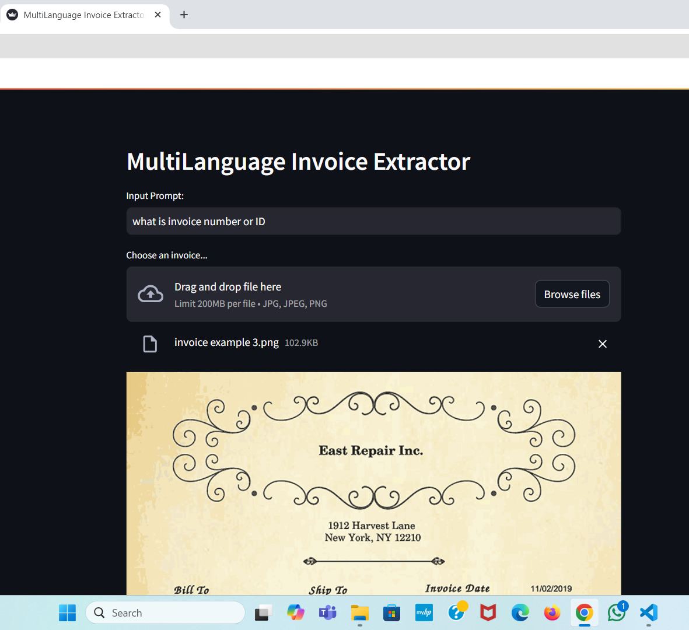
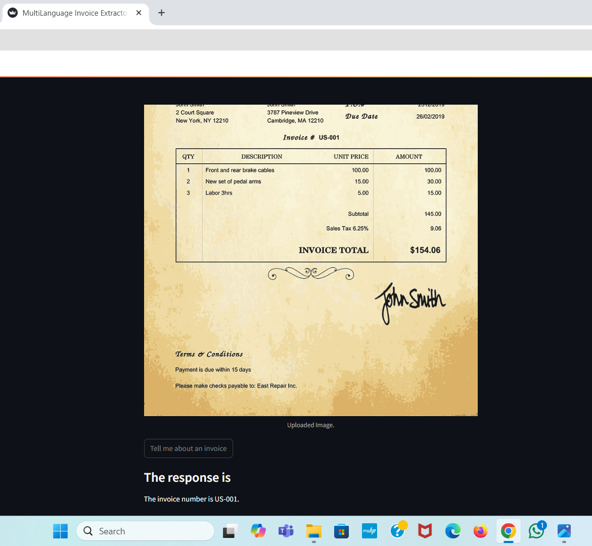

# MultiLanguage Invoice Extractor

This project is a **Streamlit-based web application** that uses **Google's Gemini AI** to extract information from uploaded invoices in multiple languages. Users can upload an image of an invoice and receive AI-generated responses based on the image content.

## Features
- Upload an invoice image (JPG, JPEG, PNG formats).
- Extract details using **Google Gemini AI**.
- Provide a natural language prompt for specific invoice-related questions.
- Support for multilingual invoice data extraction.

## Table of Contents
1. [Project Description](#project-description)
2. [Technologies Used](#technologies-used)
3. [Setup and Installation](#setup-and-installation)
4. [How to Run the Project](#how-to-run-the-project)
5. [Screenshots](#screenshots)
6. [License](#license)

## Project Description
This project leverages Google's **Generative AI model (Gemini 1.5)** to analyze invoice images and provide meaningful insights based on the provided image and prompt. The application is designed to be simple and user-friendly, making it easy to upload an image, ask questions, and get responses about the content in real time.

## Technologies Used
- **Python** for backend logic
- **Streamlit** for the web app UI
- **PIL (Python Imaging Library)** for image handling
- **Google Gemini AI** for natural language processing and image analysis
- **dotenv** for managing environment variables

## Setup and Installation

### Prerequisites
Before running the project, ensure you have the following installed:
- Python 3.8 or higher
- Streamlit
- Google Gemini AI package
- PIL (Python Imaging Library)
- dotenv (to handle API keys)

### Steps to Set Up


1. **Clone the Repository:**
   ```bash
   git clone https://github.com/your-username/multilanguage-invoice-extractor.git
   cd multilanguage-invoice-extractor

2. **Create a Virtual Environment (Optional but Recommended):**
    ```bash
   python3 -m venv env
   source env/bin/activate    # On Windows: env\Scripts\activate

3.  **Install Dependencies:**
    ```bash
      pip install -r requirements.txt

4. **Set Up Environment Variables:**
   - Create a .env file in the root directory and add your Google API key:
   ```bash
   GOOGLE_API_KEY=your_google_api_key

5. **Download and Install Required Python Libraries:**
   - If requirements.txt is missing, manually install the packages:
   ```bash
   pip install streamlit pillow python-dotenv google-generativeai

### How to Run the Project

1. After installing all dependencies and setting up the .env file, start the Streamlit app using the following command:
    ```bash
    streamlit run app.py

2. Open a browser window and go to http://localhost:8501 (Streamlit will usually auto-open it).

3. You will see the MultiLanguage Invoice Extractor interface. From there, you can:

   -Enter a prompt or question about the invoice.
   -Upload an invoice image in the form of JPG, JPEG, or PNG.
   -Click "Tell me about an invoice" to submit.

 4. The extracted response from Google Gemini AI will be displayed below the button.

### Screenshots






   


   

